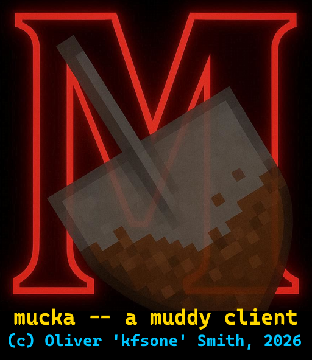
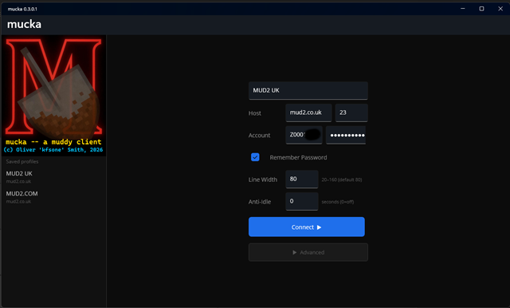
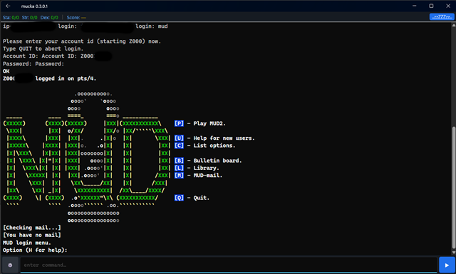
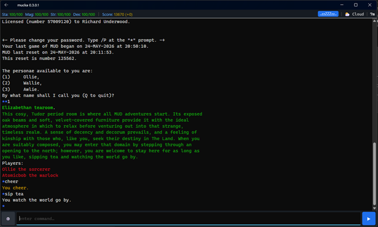
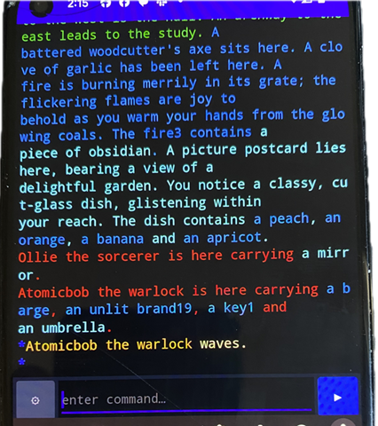

mucka -- a muddy client -- Copyright (C) Oliver 'kfsone' Smith, 2026
====================================================================

mucka is a dedicated MUD2 client for Windows, Android, heavily inspired
by Ian Peattie's "Clio".

MUD is Copyright (C) 1991-2026 [Multi-User Entertainment Ltd](https://mud.co.uk/muse/).

See also: [MUDII.co.uk](https://mudii.co.uk/), [MUD2.com](https://www.mud2.com/),
and [British Legends (MUD1)](https://www.british-legends.com/).

Clio is Copyright (C) Ian Peattie 2023.  https://www.wabe.org.uk/clio/

mucka is Copyright (C) Oliver 'kfsone' Smith, 2026. https://github.com/kfsone/mucka/

## Screenshots

